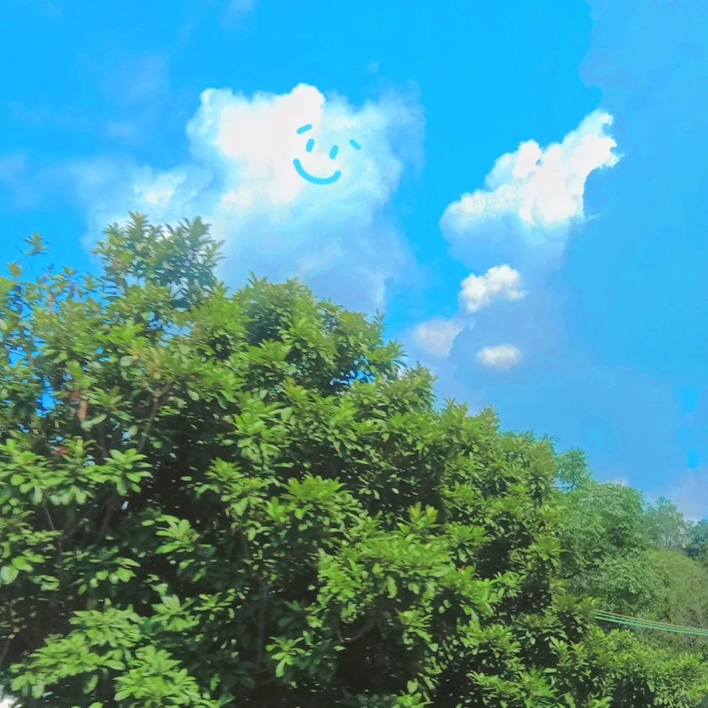

<h1 align="left">hello!👋I'm Yu Wang</h1>

- 🌱 I'm currently studying computer science, large language models (LLMs), and AI-related topics.

- 💬 Welcome to my personal blog: 
  [暂无](https://www.notion.so/lifetime-f17091fc91b7402da7d10d3f85bcf01c)
- 📫 How to reach me:
  [暂无]()
- ⚡ Fun fact: ***Live with gusto and pesto***

<h3 align="left">Languages and Tools:</h3>

 

 
 
 
  
 
 
 
 
 
 

<h3 align="left">Have a nice day!</h3>

<!--
插入风景图片

-->

    

